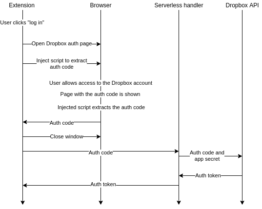
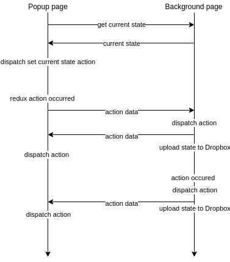
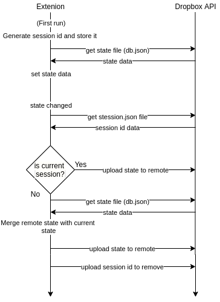

  

[Chrome store](https://chrome.google.com/webstore/detail/peakcher-2/iimmbnkpceokheecnikobjbpnnenbeap)

# Peakcher browser extension

## Functionality

This extension links to the dropbox account and then provides the ability to:
1) Upload images to your Dropbox from your computer
2) Upload images directly from websites by clicking on "Save to Peakcher" context menu action
3) Set tags to the uploaded pictures and perform a search, displays pictures list in the extension popup window

Also, in the ongoing version, there will be an ability to edit an image (add text, draw curves, lines, rectangles, etc.)

## How it works

Extension communicates directly with Dropbox API. Basically, we need to upload images and JSON 
database with images' data(URL, size, width, height, tags, etc.), and extension settings (popup width, popup height,
protect from data loss flag).

### Auth

To perform operations with Dropbox API, we need Dropbox Auth Token. Dropbox has two options to get it:
1) Redirect to your website with a token in URL if a user allows access to his account
2) Show page with Auth Code if a user allows access to his account, so you need to send it with your 
application secret to Dropbox API to get Auth Token

I choose the second option because I wanted it to be more self-contained. But in this case, we need to send an app secret and therefore have it inside the client-side code. It is terrible, so I decided to create a small serverless handler which 
takes auth code, adds secret, sends a request to Dropbox API and responds with Auth Token ([repo](https://github.com/Kontsedal/peakcher-lambda))

Whole auth flow is described in the next diagram:

### Extension state

Our extension contains two separate contexts: the background page and the popup page. Each page has its own Redux
store instance, and its states should always be in sync. Also, the state should be uploaded to the Dropbox on each change.

To solve this, I decided to make a single source of truth, and it is the background page state.
 When we show the popup page, it requests the background to take the current state and set it. Then, when some redux action
 occurs on the popup side, it doesn't dispatch it to the own redux, it sends it to the background, background dispatches it,
 and sends action back, and only then we dispatch action in the popup.
 
 There is the diagram of the flow: 
 

## Data loss protection

There is a high chance of data loss if a user uses two computers simultaneously. It is because we download state from Dropbox only on the first run, then we upload it to the Dropbox when it changes. To solve this, we generate a unique id for each user session.
Then, when a user uploads state to the Dropbox, we also upload the small file called "session.json" with the session id.
Before each state upload, we download this session file and compare ID with the current one, if they are different, we download state 
from the Dropbox and merge it with the current state, and then upload.
This whole flow makes extension slow(on adding images and tags, not for search), so it is disabled by default and
user should enable it in the settings page. 

 There is the diagram of the flow: 
 

## Roadmap
1) Add ability to edit images (add text, draw curves, lines, rectangles, etc.)
2) Refactor
3) Cover by unit and e2e
4) Use GitHub CI for tests and linting
5) Add support for GoogleDrive and OneDrive(if possible)
